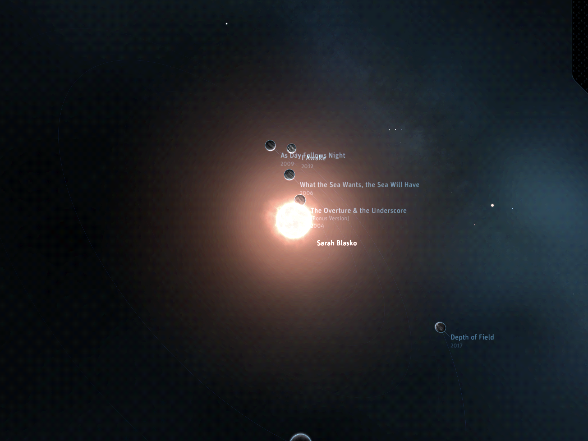
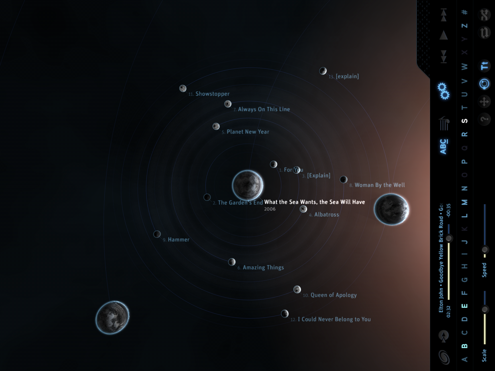
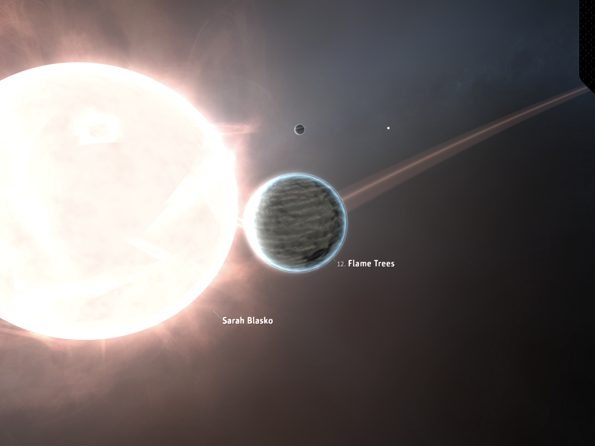

## Contact & Download

* e-mail: [kemalenver+planetary@gmail.com](kemalenver+planetary@gmail.com)

    
  

---

## Further Reading

* [Planetary: collecting and preserving code as a living object](https://www.cooperhewitt.org/2013/08/26/planetary-collecting-and-preserving-code-as-a-living-object)
* [Ben Cerveny on Planetary](https://www.cooperhewitt.org/2015/06/26/ben-cerveny-on-planetary/)
* [Planetary, Cooper Hewitt's First iOS App](https://www.cooperhewitt.org/2019/05/16/planetary-cooper-hewitts-first-ios-app/)
* [A Love Letter to Planetary](https://www.cooperhewitt.org/2022/02/16/a-love-letter-to-planetary/)
* [How Does a Museum Acquire an iPad App for its Collections?](https://www.smithsonianmag.com/smithsonian-institution/how-does-a-museum-acquire-an-ipad-app-for-its-collections-880301/)
* [On Planetary in 2020: curatorial activism and open sourcing in service of digital preservation](https://buttondown.com/sebchan/archive/48-on-planetary-in-2020-curatorial-activism-and/)

---

## Planetary Instructions

- Add albums to your Apple Music library (If you don't add albums you won't see anything).  

- Note that if you change tracks in Apple Music, Planetary will update to play that song when you open it.

- Open Planetary and give the app permission to access your music.

- Use the controls at the bottom to filter by artist names.

- Tap on an artist to zoom in and see their albums.

- Tap on an album to see the tracks.

- Tap a track to play it.

---

## Acknowledgment

Original concept and code by Bloom Studios.

App has been updated to work with modern sdks and platforms by Kemal Enver.

|  |  |
|  |  |
|  |  |

