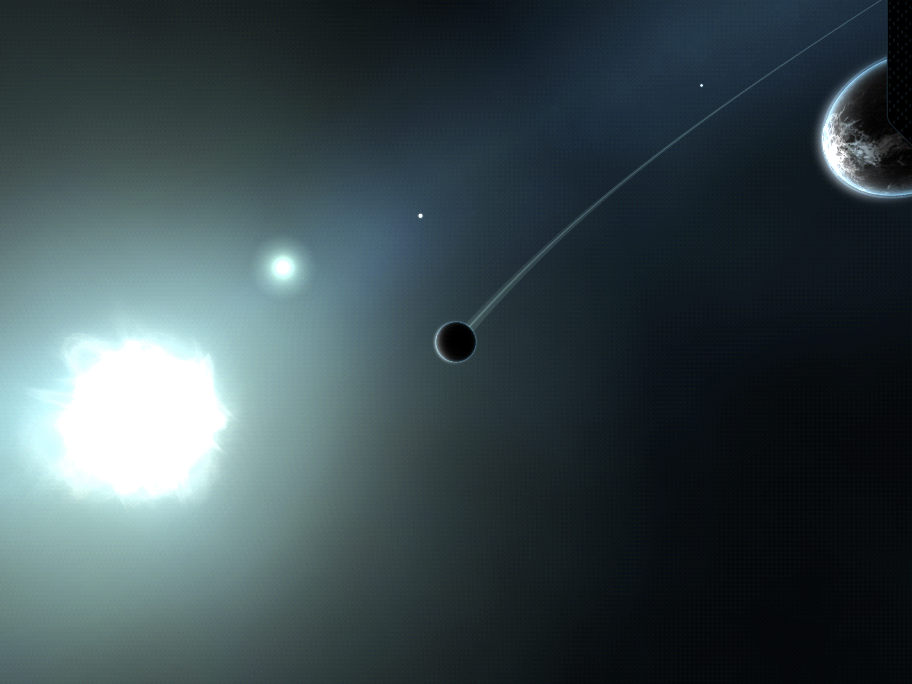

## Contact & Download

* e-mail: [kemalenver+planetary@gmail.com](kemalenver+planetary@gmail.com)

* download: [Planetary Remastered](https://apps.apple.com/us/app/planetary-remastered/id1473561807?mt=8)
  

---

## Further Reading

* [Planetary: collecting and preserving code as a living object](https://www.cooperhewitt.org/2013/08/26/planetary-collecting-and-preserving-code-as-a-living-object)
* [Ben Cerveny on Planetary](https://www.cooperhewitt.org/2015/06/26/ben-cerveny-on-planetary/)
* [Planetary, Cooper Hewitt's First iOS App](https://www.cooperhewitt.org/2019/05/16/planetary-cooper-hewitts-first-ios-app/)
* [A Love Letter to Planetary](https://www.cooperhewitt.org/2022/02/16/a-love-letter-to-planetary/)
* [How Does a Museum Acquire an iPad App for its Collections?](https://www.smithsonianmag.com/smithsonian-institution/how-does-a-museum-acquire-an-ipad-app-for-its-collections-880301/)
* [On Planetary in 2020: curatorial activism and open sourcing in service of digital preservation](https://buttondown.com/sebchan/archive/48-on-planetary-in-2020-curatorial-activism-and/)

---

## Planetary Instructions

Add albums to your Apple Music library (If you dont add albums you wont see anything).  

Note that if you change track in Apple Music, Planetary will update to play that song when you open it.

Open Planetary and give the app permission to access your music

Use the controls at the bottom to filter by artist names

Tap on an artist to zoom in and see their ablums

Tap on an album to see the tracks

Tap a track to play it

---

## Acknowledgment

Original concept and code by Bloom studios

App has been updated to work with modern sdks and platforms by kemal enver

|  |  |
|  |  |
|  |  |

